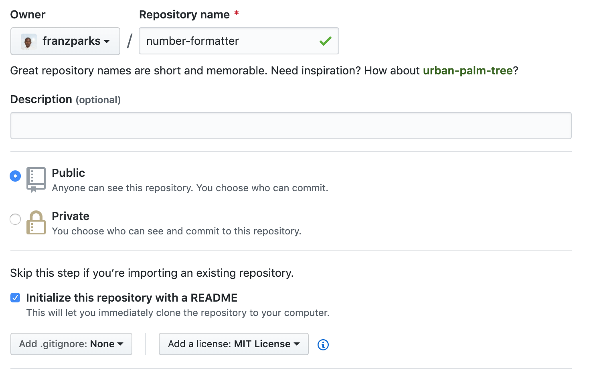
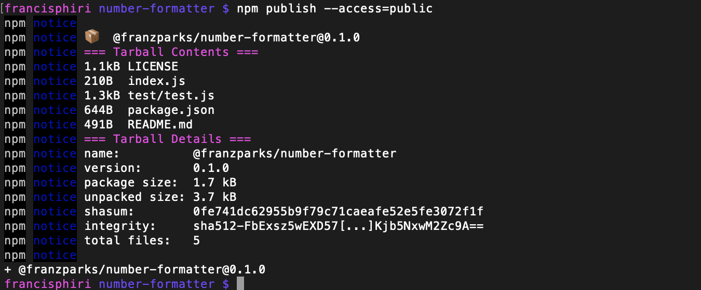
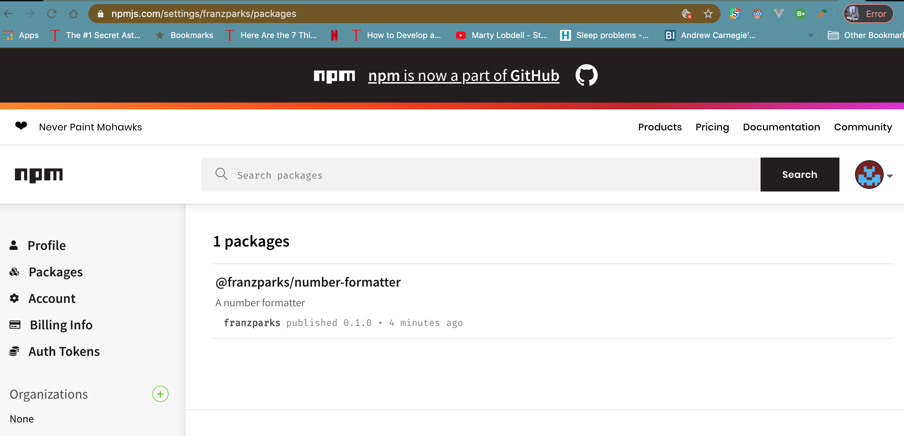
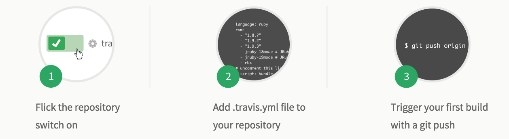
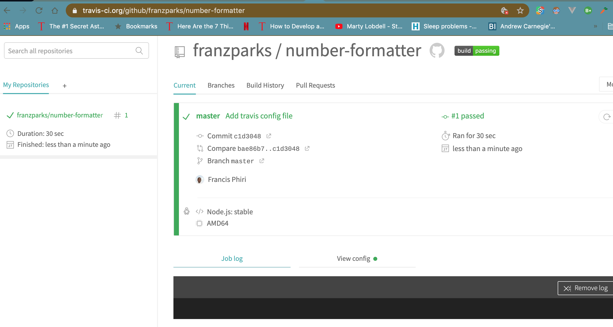

 # How to create and share a package/dependency
 ---
*By Francis Phiri*

Many programming languages provide a way to publish packages/dependencies so that they can be used by others as libraries. npm makes it easy for JavaScript developers to share and reuse code, and it makes it easy to update the code that you’re sharing. 

To demonstrate the process of creating a package and publishing it to npm, here is a demo:

## Pre-reqs

Assuming you already have a github account [Github](https://github.com/)
And have [Node.js](https://nodejs.org/en/) installed

1. Create an [npm account](https://www.npmjs.com/) (and confirm your npm account email address‏)
2. Create a [Travis CI](https://travis-ci.org) account (using GitHub)
3. Create a [Coveralls account](https://coveralls.io) (using GitHub)

## Create a GitHub repo

- Create a new repo on GitHub and call it “number-formatter” (make sure you check the README box, add a .gitignore file for Node, and a MIT license)
- Clone it locally



Note: Make sure you add a README, .gitignore, and license

## Why add a license?
It’s your right not to include a license with your code or project, but the absence of a license means that the default copyright laws apply. This means that you retain all rights to your source code and that nobody else may reproduce, distribute, or create derivative works from your work. This might not be what you intend.

## Tell npm who you are

```
npm set init.author.name "Your Name"

npm set init.author.email "your.name@gmail.com"

npm set init.author.url "http://www.authorurl.com"
```

Your credentials will be now saved to a **~/.npmrc** file and used as defaults whenever you initialize a npm package, so you don’t have to enter them each time.
To authenticate on your machine, log in with your npm **username**, **password**, and **email**.

`
npm login
`

## Initialize a npm package

When you create a new module, you want to describe your **package** with the package.json file.

`
npm init
`

Answer all the questions you’re prompted.

For the **version**, let’s start with

`
0.1.0
`

When you make changes to your library in the future, remember to update the version according to semantic versioning(https://semver.org) (SemVer).

You should now see a **package.json** file in your project folder.

## Specify a minimum Node version
By adding the following (optional) to your **package.json**, you can specify the minimum Node version that your package requires to ensure your library will work for your users.

`
"engines": {
  "node": ">=4.2.4"
}
`

## Create a node module

A Node/npm module is just a regular JavaScript file, but it must follow the [CommonJS module spec](http://wiki.commonjs.org/wiki/Modules/1.1). [UMD](https://github.com/umdjs/umd), which is CommonJS compatible, also works.

Now, let’s create a very tiny module and name the file **index.js**.

```
'use strict';

/**
 * Adds commas to a number
 * @param {number} number
 * @param {string} locale
 * @return {string}
 */
module.exports = function(number, locale) {
    return number.toLocaleString(locale);
};

```

## Write some tests

In the demo am using the [Mocha](https://mochajs.org) testing framework and [Chai](https://chaijs.com) assertion library.

In the project root

`
npm i mocha -D
npm i chai -D
`

Create a **test** folder and a **test.js** file inside of it.

`
mkdir test && touch test/test.js
`

Add the following sample tests to the **test.js** file.

```
'use strict';

var expect = require('chai').expect;
var numFormatter = require('../index');

describe('#numFormatter', function() {
    it('should convert single digits', function() {
        var result = numFormatter(1);
        expect(result).to.equal('1');
    });

    it('should convert double digits', function() {
        var result = numFormatter(12);
        expect(result).to.equal('12');
    });

    it('should convert triple digits', function() {
        var result = numFormatter(123);
        expect(result).to.equal('123');
    });

    it('should convert 4 digits', function() {
        var result = numFormatter(1234);
        expect(result).to.equal('1,234');
    });

    it('should convert 5 digits', function() {
        var result = numFormatter(12345);
        expect(result).to.equal('12,345');
    });

    it('should convert 6 digits', function() {
        var result = numFormatter(123456);
        expect(result).to.equal('123,456');
    });

    it('should convert 7 digits', function() {
        var result = numFormatter(1234567);
        expect(result).to.equal('1,234,567');
    });

    it('should convert 8 digits', function() {
        var result = numFormatter(12345678);
        expect(result).to.equal('12,345,678');
    });
});
```

## Run the tests

`
npm test
`

## Write a README

Update the [README.md](https://github.com/18F/open-source-guide) (markdown) file with details and usage examples for your users, especially since this will be displayed prominently on GitHub and npm.

```
Number Formatter
=========

A small library that adds commas to numbers

## Installation

  `npm install @franzparks/number-formatter`

## Usage

    `var numFormatter = require('@franzparks/number-formatter');

    var formattedNum = numFormatter(35666);`
  
  
  Output should be `35,666`


## Tests

  `npm test`

## Contributing

In lieu of a formal style guide, take care to maintain the existing coding style. Add unit tests for any new or changed functionality. Lint and test your code.
```

*Note*: It is also a common practice to have a separate [CONTRIBUTING.md](https://github.com/babel/babel/blob/master/CONTRIBUTING.md) file for your contribution guidelines.

## Commit & push to GitHub

Let’s create a version tag as well.

`
git add .
git commit -m "Initial release"
git tag v0.1.0
git push origin master --tags
`

## Publish to npm

`
npm publish
`

If you run into errors with the above command, it could mean that the package name is already taken. In that case, you might want to either rename or scope your package.
**Scoped packages are private by default**. To publish private modules, you need to be a paid private modules user.
However, public scoped modules are free and don’t require a paid subscription. To publish a public scoped module, set the access option when publishing it. This option will remain set for all subsequent publishes.

`
npm publish --access=public
`


Log in to your npm account and your module should show up there.



## Add continuous integration
[Travis CI](https://travis-ci.org/) is a lightweight continuous integration tool that runs tests on every commit to your GitHub repo, even pull requests. It’s free for open source projects.
Log in to your Travis CI account, and follow these steps



This is what your **.travis.yml** file should look like in the project root

```
language: node_js

node_js:
  - stable

install:
  - npm install

script:
  - npm test
```

**Commit** and **push** to GitHub.

Log in to Travis to see your build status! You will also get email notifications.



To make the package even better you can add:
- Code coverage and statistics with [Instanbul](http://gotwarlost.github.io/istanbul/), [Coverall](https://coveralls.io/)

## Test out your module

Create a new directory and a package.json file.

```
{
  "dependencies": {
    "project-name": "*"
  }
}
```

Then from the command line

`
npm i
`

Create an index.js file with the following content

```
var numFormmater = require('project-name');

var formattedNum = numFormmater(234324234);

console.log(formattedNum);
```

**Reminder**: If you published a scoped module, update the project name to

`@username/project-name`

Then from the command line

`
node index
`

You should see a console log of

`
234,324,234
`

## Sources:

<http://slidedeck.io/saintedlama/be-a-good-npm-module>
<https://h3manth.com/new/blog/2015/authoring-node-modules/>
<https://gist.github.com/jxson/1784669>
